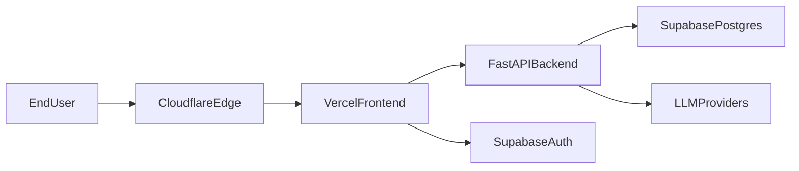

# Personal Finance Coach

Production-focused full-stack app for receipt OCR, transaction tracking, budgeting, and AI financial coaching.

## PRD

### Objective
Ship a secure, free-tier-ready production setup using:
- Supabase for managed Auth + Postgres
- Vercel for frontend hosting
- Cloudflare for DNS, TLS, WAF, and bot protection

### Users
- Individuals tracking expenses and budgets
- Users uploading receipts for OCR-driven transaction extraction

### Core Features
- Email/password and Google-based authentication
- Receipt upload and OCR extraction
- Transaction CRUD and categorization
- Budget and bill tracking
- AI-generated coaching suggestions

### Non-Functional Requirements
- Free-tier compatible operations (Supabase Free, Vercel Hobby, Cloudflare Free)
- Zero secrets committed in git
- Explicit DB migrations for schema changes
- Security headers, WAF, and rate limiting enabled
- Health endpoint and error monitoring enabled

### Success Metrics
- Deploy pipeline passes on each main release
- Auth failure rate under 1%
- P95 latency under 500ms for standard API endpoints
- No runtime schema mutation in production startup

## Architecture



## Tech Stack
- Frontend: React 19, TypeScript, Vite 8, Tailwind CSS
- Backend: FastAPI, SQLAlchemy async, Alembic
- Data: Supabase Postgres (with `vector`), Redis
- Deployment: Vercel (frontend), container host for backend
- Security: Cloudflare WAF + Turnstile + TLS

## Local Development

### 1. Prerequisites
- Docker + Docker Compose
- Python 3.12+
- Node.js 20+

### 2. Environment Setup
Copy `.env.example` to `.env` and fill required values.

### 3. Start Backend Stack
```bash
cd infra
docker-compose up -d --build
```

### Backend (local) quick start

For developing or running backend tests locally without Docker:

```powershell
cd backend
Set-ExecutionPolicy -ExecutionPolicy RemoteSigned -Scope Process -Force
python -m venv .venv
. .\.venv\Scripts\Activate.ps1
python -m pip install --upgrade pip
pip install -r requirements.txt
# Run unit tests
pytest -q
# Run dev server
uvicorn app.main:app --reload --host 127.0.0.1 --port 8000
```

Note: `requirements.txt` pins `bcrypt==3.2.0` to avoid a known incompatibility with `passlib[bcrypt]` and newer `bcrypt` releases. If you encounter bcrypt-related errors, reinstall with `pip install bcrypt==3.2.0` inside the venv.

### 4. Start Frontend
```bash
cd frontend
npm install
npm run dev
```

## Deployment (Production)

### Frontend on Vercel
1. Connect repo to Vercel.
2. Set root directory to `frontend`.
3. Build command: `npm run build`.
4. Configure env vars (`VITE_API_URL`, `VITE_SUPABASE_URL`, `VITE_SUPABASE_ANON_KEY`).

### Backend with Supabase Postgres
1. Deploy `infra/Dockerfile.backend` to your container provider.
2. Use Supabase Postgres connection string.
3. Run Alembic migrations before serving traffic.
4. Set `ENVIRONMENT=production` and all required secrets.

### Cloudflare Security Baseline
1. Point domain nameservers to Cloudflare.
2. Enable proxy, TLS mode `Full (strict)`.
3. Enable managed WAF rules.
4. Add rate limits for `/auth/*` and upload endpoints.
5. Add Turnstile to auth/reset/upload flows.

## CI and Release Gates
- Backend lint + tests
- Frontend lint + build
- Secret scan and dependency audit
- Smoke tests on `/health`, auth flow, receipt upload

## Operational Rules
- Never commit real API keys or service-role keys.
- Keep schema changes in Alembic migrations only.
- Keep PRs small and testable.
- Rotate secrets on leak suspicion.
"# Finlo-yourallin1finance" 
